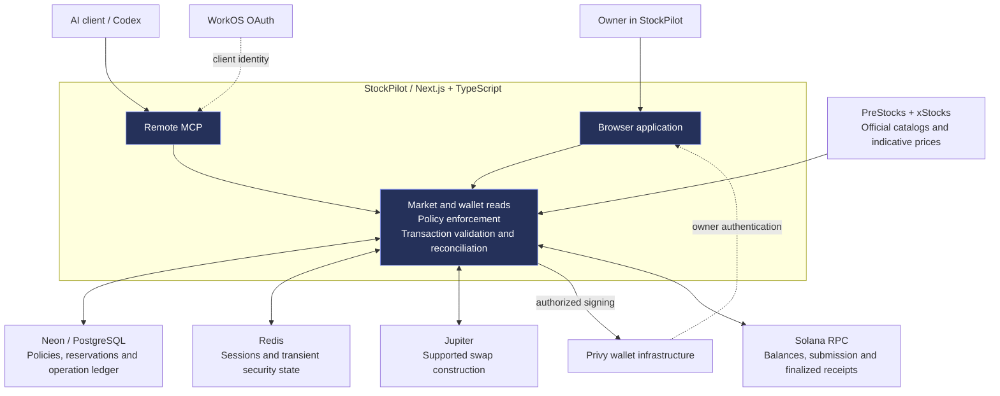
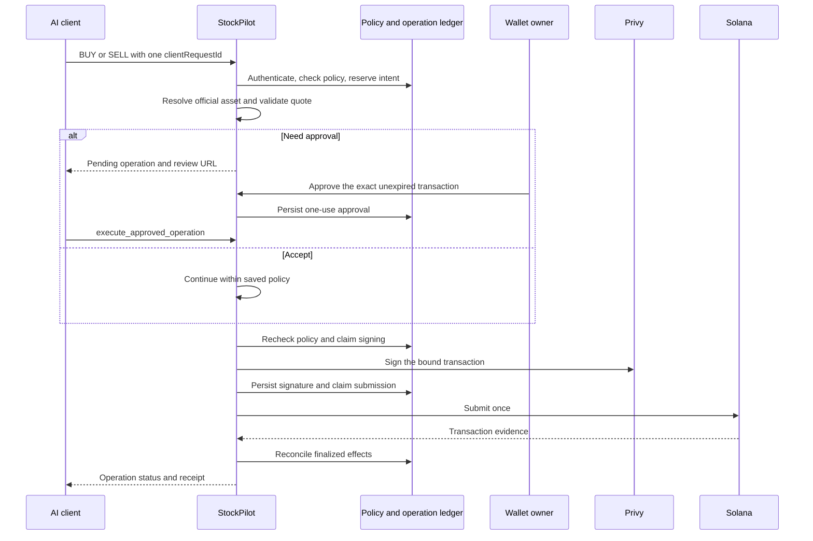

<p align="center">
  
</p>

<h1 align="center">StockPilot</h1>

<p align="center"><strong>An investing wallet for you and your AI agent.</strong><br />
Discover tokenized stocks and Pre-IPO assets on Solana. Trade supported products under rules you control.</p>

<p align="center">
  <a href="https://stockpilot.endpx.cloud">Live app</a> ·
  <a href="https://www.youtube.com/watch?v=9lGeG6NcrNY">Pitch video</a> ·
  <a href="https://www.youtube.com/watch?v=sRwStj5Co7E">Technical demo</a> ·
  <a href="#mainnet-evidence">Mainnet evidence</a> ·
  <a href="#architecture">Architecture</a>
</p>

---

## The idea

An investor can research an asset in an AI chat, inspect holdings in a wallet, and trade in another application. StockPilot brings those steps into one investing wallet, while making the agent's spending permissions explicit.

Use the application directly or connect an MCP-compatible AI client. Explore official PreStocks and xStocks products, read your Solana balances, and trade eligible assets. The owner controls what the agent can read, which market actions it can take, and whether those actions need approval.

**Connecting an AI app does not, by itself, authorize spending.** Wallet delegation and an owner-saved execution policy are separate requirements.

## Demo

| Resource | Purpose |
| --- | --- |
| [Pitch video](https://www.youtube.com/watch?v=9lGeG6NcrNY) | Product story and the problem StockPilot addresses |
| [Technical demo](https://www.youtube.com/watch?v=sRwStj5Co7E) | Recorded wallet, policy, Codex/MCP, and transaction-verification workflow |
| [Live app](https://stockpilot.endpx.cloud) | Wallet, markets, connected agents, policy, and transaction activity |

## What StockPilot provides

| Area | User experience |
| --- | --- |
| **Markets** | Separate Stocks/xStocks and Pre-IPO/PreStocks discovery, with canonical issuer mint identities |
| **Wallet** | Confirmed SOL, canonical USDC, and supported investment holdings read from Solana |
| **Manual trading** | An exact amount, a reviewed Jupiter quote, and a signature from the matching Privy wallet |
| **Agent connections** | Browser authorization through WorkOS OAuth and a remote MCP endpoint |
| **Agent policy** | One permissions table, independent read/write decisions, market-level trading rules, recipient restrictions, limits and expiry |
| **Approvals** | Review an exact prepared transaction before an approval-required agent action can proceed |
| **Activity** | Persistent operation IDs and transaction signatures, with reconciliation against finalized chain effects |

### Latest deployment scope

The trading path is **catalog-driven**, rather than restricted in code to the original Polymarket/AAPLx demonstration pair. It resolves eligible official PreStocks and xStocks entries and validates each mint and transaction before signing.

That does **not** mean every listing can always be bought or sold. An asset still needs usable issuer evidence, a non-halted state, sufficient wallet funds, compatible token semantics, and a supported liquid route. The current strict route decoder supports direct **Meteora DLMM** and **Raydium CLMM** paths. Unsupported routes remain blocked.

For xStocks whose exact Equity/ETF type is missing, validated issuer-reported exchange and underlying identifiers can establish catalog admission without relabeling the product. These remain visibly classified as public-market products. Listing evidence is not legal clearance or execution proof.

The prototype trade path remains bound to the **configured demo wallet**. The owner chooses the amount; **0.10 USDC is a test amount, not an application-wide cap**.

## Mainnet evidence

An agent-initiated Polymarket PreStocks BUY completed on **Solana mainnet on 26 September 2026, 00:56 WIB** under the owner's saved policy and wallet delegation.

| Observed result | Value |
| --- | --- |
| USDC spent | **0.10 USDC** |
| Tokens received | **0.00065276 POLYMARKET** |
| Network fee | **0.000006035 SOL** |
| Finalized slot | `450426196` |
| Chain result | Finalized success, no transaction error |

[View the transaction on Solscan](https://solscan.io/tx/4uGCz6UgEGK25pnPXCXHgJbE56rVwky91eemUyLKQQQq4BLq4jZVvCrtVVoAa2DSk4DiUpj1AUPpNZNuZkhvSzmQ)

Two separately operated RPC providers returned the same successful finalized receipt, and an authenticated portfolio read showed the matching holding. The operation used delegated signing without a new per-transaction browser approval. The chain establishes settlement; the application operation record and owner test context establish the agent execution path.

The owner also reported successful manual Polymarket BUY and SELL tests. **Agent SELL, transfers, and every other catalog product need their own end-to-end acceptance evidence.** A registered tool, quote, green test suite, or enabled health flag is not a substitute for a finalized transaction.

The recorded receipt above predates the later technical-video take; it is not presented as the signature for every recorded purchase.

## Architecture



StockPilot enforces per-agent rules in its application and database. Privy supplies wallet signing, Jupiter supplies supported swap construction, and Solana supplies wallet state and settlement evidence. There is no custom StockPilot token or on-chain policy contract.

**Trust boundary:** the server remains trusted for per-agent budgets and recipient restrictions. Provider signing policies add constraints but do not independently reproduce every application rule. These controls are not an independent security audit or a guarantee against loss.

## One policy table

The latest policy groups actions under **Pre-IPO**, **Stocks**, and **Wallet**.

| Mode | Transaction behavior |
| --- | --- |
| **Accept** | May execute within the saved rules and wallet delegation without another per-transaction approval |
| **Need approval** | Stores an exact quote for owner review; does not sign or submit before approval |
| **Deny** | Refuses the action |

Read rows offer Accept or Deny only. Read access never authorizes spending.

Market grants explicitly cover current and future official products that pass runtime checks. **Existing asset-specific policies are not silently upgraded.** The owner must edit and save the new policy to authorize broader market access.

BUY limits use USDC. Market-wide SELL limits use the verified quote's USDC value as a notional budget, while the actual sold quantity stays in exact base-token units. Transfer limits use SOL or USDC. Limits, recipient rules, expiry, and Unlimited choices remain explicit owner inputs.

## How an approval-required trade works



An approval cannot authorize a different amount, recipient, quote, or blockhash. Expired reviews cannot execute. The owner decision endpoint itself does not submit a transaction; the agent explicitly resumes the approved operation.

`SUBMITTED` and `UNKNOWN` remain unresolved until sufficient evidence arrives. Status reads never sign or send. A repeated request ID inspects the existing intent instead of creating another purchase. An expired blockhash alone is not proof that a transaction failed.

## Connect an AI client

Add the remote MCP server and complete browser authorization:

```text
https://stockpilot.endpx.cloud/api/mcp
```

Start with a read:

```text
check my balance on stockpilot
```

After explicitly enabling the necessary wallet delegation and policy, a new purchase can be requested with:

```text
buy polymarket pre-ipo for 0.1$
```

The second prompt can move real funds. If the result is pending, check the **same operation** instead of repeating the BUY with a new request ID.

### Latest server tool interface

| Purpose | Tools |
| --- | --- |
| Stocks | `list_stocks`, `get_stock` |
| Pre-IPO | `list_pre_ipo`, `get_pre_ipo` |
| Wallet | `get_balance`, `get_portfolio` |
| Trading | `buy_stock`, `sell_stock`, `buy_pre_ipo`, `sell_pre_ipo` |
| Transfers | `transfer_sol`, `transfer_usdc` |
| Operations | `get_operation`, `list_operations`, `execute_approved_operation` |
| Legacy consent requests | `request_investment`, `get_request`, `list_requests` |

Each invocation checks the applicable live policy. Legacy consent requests are distinct from executable transaction approvals; a unified-policy client uses the trade tools for its approval flow.

## Run locally

Use Node.js 24 and pnpm 10.21.0.

```bash
git clone https://github.com/EndPx/stockpilot.git
cd stockpilot
pnpm install --frozen-lockfile
```

Copy `apps/web/.env.example` to `apps/web/.env.local`, keep authentication and execution disabled for the initial read-only setup, then run:

```bash
pnpm dev
```

Open [localhost:3000](http://localhost:3000). The example configuration does not recreate the authenticated live deployment. Privy, WorkOS, Redis, Neon migrations and separately provisioned signing authorization require deliberate setup. Never copy production secrets into the repository.

```bash
pnpm test
pnpm build
```

These commands run regression tests and a production build. Neither establishes mainnet transaction acceptance.

## Project map

| Directory | Responsibility |
| --- | --- |
| [`apps/web`](apps/web) | Application, authentication, APIs/MCP, policies and execution orchestration |
| [`packages/core`](packages/core) | Asset registry, portfolio domain, exact token amounts and investment constraints |
| [`packages/integrations`](packages/integrations) | Issuer catalogs, market-data adapters and Jupiter integration |
| [`src`](src) | Read-only integration/validation tools |
| [`tests`](tests) and [`apps/web/tests`](apps/web/tests) | Domain, API, UI-contract and transaction-boundary regression tests |
| [`deploy`](deploy) | Container, reverse-proxy, migration-grant and release tooling |

Engineering documentation: [wallet execution](docs/AGENT_WALLET_EXECUTION.md), [expiry recovery](docs/AGENT_EXPIRY_RECOVERY.md), [xStocks evidence](docs/XSTOCKS_PRODUCT_EVIDENCE.md), and [brand provenance](docs/IMAGE_PROVENANCE.md).

## Scope and risk

StockPilot is a hackathon prototype, not a production-ready brokerage. The demo uses WorkOS Staging and expiring server signing authorization. Wallet delegation, current provider configuration, supported routes and operator readiness all affect availability.

**Not for U.S. persons.** Issuer and jurisdiction restrictions apply. An available catalog entry, owner declaration, or swap route does not establish investor eligibility. Tokenized assets carry risk of total loss; PreStocks exposure does not necessarily confer direct company ownership, voting rights, or shareholder rights.

Code is available under the [MIT License](LICENSE). Issuers and infrastructure providers retain their own terms.
